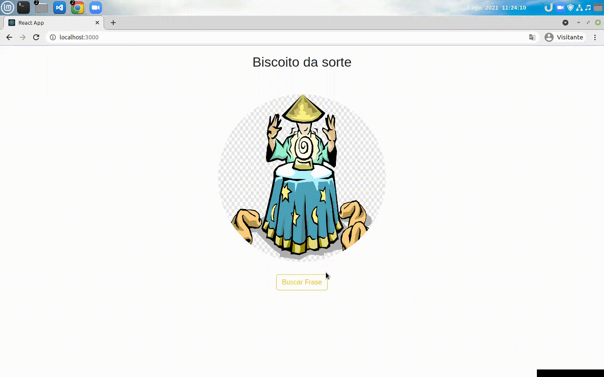

### Olá, seja bem vindo(a) ao projeto Biscoito da sorte 🍪

Este projeto consiste em uma simples aplicação React onde há um botão
de buscar frases aleatórias. Utilizei os conceitos de estado, passagem de
props e componentização do React.
Abaixo deixo uma exemplificação do projeto em funcionamento.

## Começando

- Clone o repositório git clone git@github.com:clebertonf/Projeto-Biscoito-da-sorte.git
- Na raiz do projeto rode o comando npm install para instalar as depedências do projeto.

## Executando

- `"npm start": Inicia o projeto React na porta padrão 3000 `

Este projeto possui a estrutura padrão do React.

#### Utilizei os conceitos simples do React, somente para fixar o aprendizado em algo mais prático.
#### Os conceitos que estudo sempre procuro inserir em projetos práticos.
#### espero que tenha gostado, e até uma próxima!
